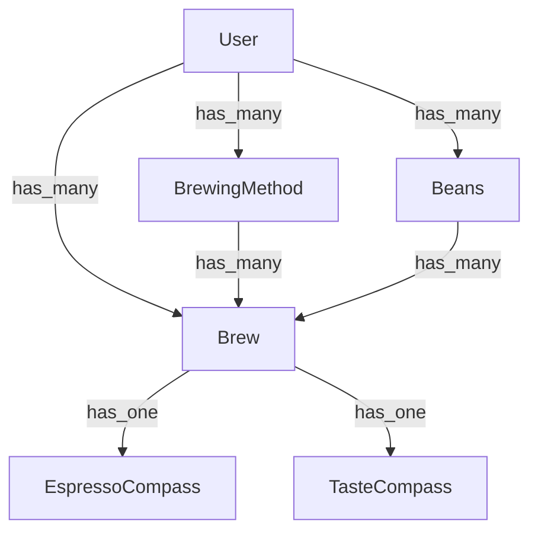

# Overview

## Name and aliases

The project is named "Brew Compass".

## Purpose

The system is designed let users track their coffee consumption and preferences. It allows them to build up a taste profile to figure out their preferences. It also helps to hone your espresso shot pulling skills by providing tips.

## Technologies

### Chosen

* Ruby on Rails
* Postgres
* nginx
* puma

## Technology relationships



## Supported browsers

All modern browsers are supported.

## How to set up the project

### External tool installation

\```
brew update --system
brew upgrade ruby-build
git clone http://github.com/RoleModel/brew_compass
cd brew_compass
rbenv install
gem install bundler
bundle install
\```

### How to run locally

`rails s`

### How to run tests

`rake`

### Editor plugins

* Rubocop linter

## Troubleshooting information

* [App Status Page](http://app.<applicationname>.com/_ping) will give you information about what is running.
* Alternatively, you can ssh in and check that the application server and web server are both running.

## Testing Strategy

### Testing approach

#### System tests

Due to the nature of this application, End User tests are...

#### Unit tests

Due to the nature of this application, unit tests are prominent and handle most of the confidence building and documentation needs of the system below the user interface.

#### Other tests

At this point, no other tests are being employed.
However, one might consider performance tests or other categories and describe the reasons here

### Testing tools

Which tools are we using?

### Continuous integration

Github Actions is being used for CI.  It is set up to run the tests on every push to the repository.

## Branching strategy

To begin a new feature run, `git checkout -b <linear-card-branch>`.
When finished with the feature and the code has been reviewed, the commits should be squashed before merging.

## List of background processes

## Links to important resources

* [Git repo](https://github.com/Jeremy-Walton/brew-compass)
* [Task management system](https://linear.app/brew-compass/team/BREW/all)
* [Staging](https://staging.brewcompass.coffee)
* [Production](https://www.brewcompass.coffee)

## External services

<!-- * [HoneyBadger](http://honeybadger.io)
* [Skylight](http://skylight.io)
* [SendGrid](http://sendgrid.com/RoleModel)
* [Heroku](http://herokuapp.com) -->

## Deployment

### Strategy/process/commands

`main` is always deployed to production. The `staging` branch is deployed to staging.
\```
git checkout main
git tag 2016-05-16 # {date} YYYY-MM-DD
git push --tags
\```

## Description of host(s), DNS, certificate authority

The application is deployed to Heroku. They are also hosting the DNS. We certificate was received from [Let's Encrypt](https://letsencrypt.org/).

## ssh information

`ssh user@hostname.com`

## Customer contacts

* Jeremy Walton - 919-621-5974

## Copyright & licensing

Copyright (c) 2025 Closed Source @JeremyWalton
